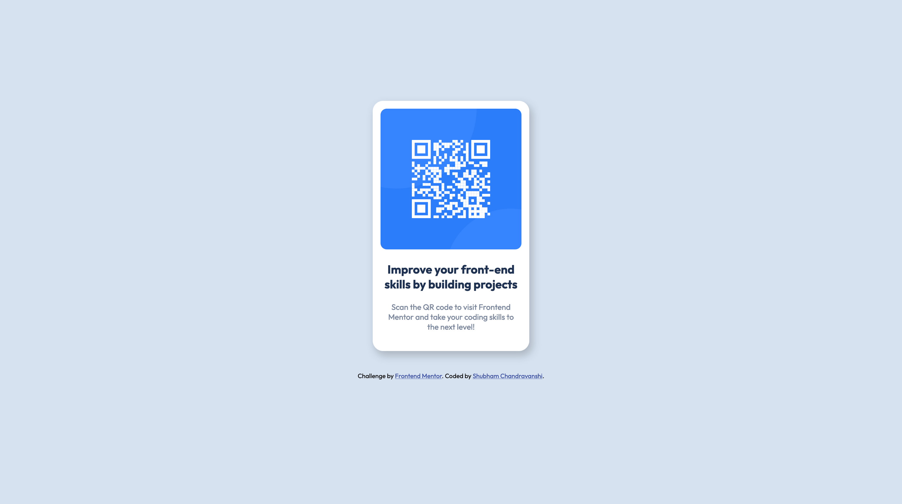

# Frontend Mentor - QR code component solution

This is a solution to the [QR code component challenge on Frontend Mentor](https://www.frontendmentor.io/challenges/qr-code-component-iux_sIO_H). In this challenge, you have to design a QR Code card using HTML & CSS matching the given desktop and mobile previews.

## Table of contents

- [Overview](#overview)
  - [Screenshot](#screenshot)
  - [Links](#links)
- [My process](#my-process)
  - [Built with](#built-with)
  - [What I learned](#what-i-learned)
  - [Useful resources](#useful-resources)
- [Author](#author)

## Overview

### Screenshot

### Links

- Solution URL: [Add solution URL here](https://your-solution-url.com)
- Live Site URL: [Add live site URL here](https://your-live-site-url.com)

## My process

### Built with

- Semantic HTML5 markup
- CSS custom properties
- Google Fonts

### What I learned

This was my first Frontend Mentor challenge, and as a person who is just starting with frontend web development, I learnt a lot about creating and styling HTML documents. I learnt how to write semantic HTML and using divs to manage and contain content, and I learned various different layout and styling properties in CSS.

This project also enabled me to further increase my understanding of the Box Model in HTML and how box-sizing affects the behaviour of different elements, and I look forward to understanding and getting comfortable with it more in the future!

I couldn't implement a responsive mobile design as of now, but that will surely be something I'll be working onto next.

### Useful resources

- [Box Shadow CSS Generator](https://cssgenerator.org/box-shadow-css-generator.html) - This site really helped me in experimenting with and generating the box-shadow styling for the QR Code card. I really liked this website as it helps you visually experiment and see different box-shadows and I will be using it going forward.

## Author

- LinkedIn - [Shubham Chandravanshi](https://www.linkedin.com/in/shubhamcweb)